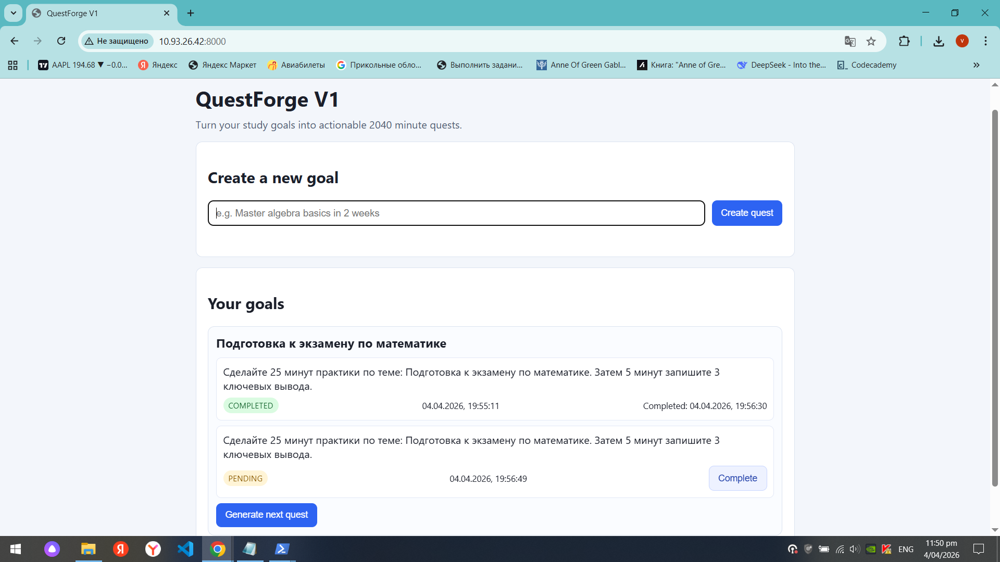
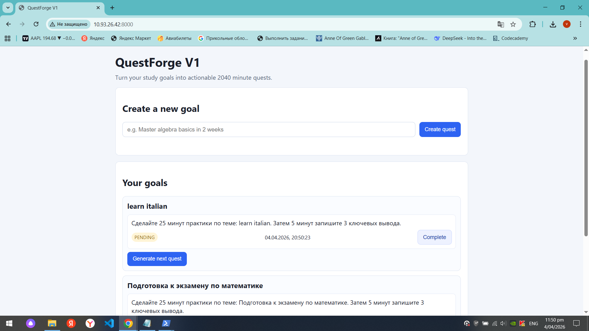
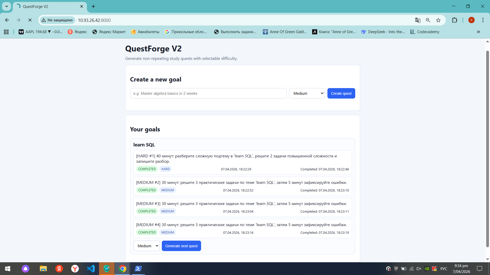

# QuestForge V2

A web app that helps students build study habits with small, structured quests.

## Demo
- Screenshot 1: goal creation + first quest generation
- 
- Screenshot 2: quest completion + next quest generation
- 
- Screenshot 3: difficulty-based quests in history
- 

## Product context

### End users
- Students preparing for exams and coursework.

### Problem that my product solves
- Students have vague study goals and struggle with consistency.
- They need clear, short, actionable tasks.

### My solution
- User enters a study goal.
- System generates one concrete 2040 minute quest.
- User marks quest as completed and generates next quests.
- Difficulty levels and non-repeating logic improve study progression.

## Features

### Implemented
- Create goal
- Generate first quest
- Generate next quest
- Mark quest as completed
- Difficulty selection (easy/medium/hard)
- Non-repeating quest generation
- FastAPI + SQLite + plain HTML/CSS/JS

### Not yet implemented
- Authentication
- Multi-user support
- Notifications/reminders
- Progress analytics dashboard

## Usage
1. Enter a study goal.
2. Choose difficulty.
3. Click **Create quest**.
4. Complete quest.
5. Generate next quest with selected difficulty.

## Deployment (Docker, Ubuntu 24.04)

### VM OS
- Ubuntu 24.04

### Prerequisites
- docker.io
- docker compose plugin
- git

Install Docker:
```bash
sudo apt update
sudo apt install -y docker.io docker-compose-plugin
sudo systemctl enable --now docker
docker --version
docker compose version

### Step-by-step deployment
git clone https://github.com/VictoriaaaZork/se-toolkit-hackathon.git
cd se-toolkit-hackathon

cp .env.example .env
# set OPENAI_API_KEY / OPENAI_MODEL / OPENAI_BASE_URL in .env

docker compose up -d --build
docker compose ps
docker compose logs --tail=100

###Health check
curl -i http://127.0.0.1:8000/api/goals
